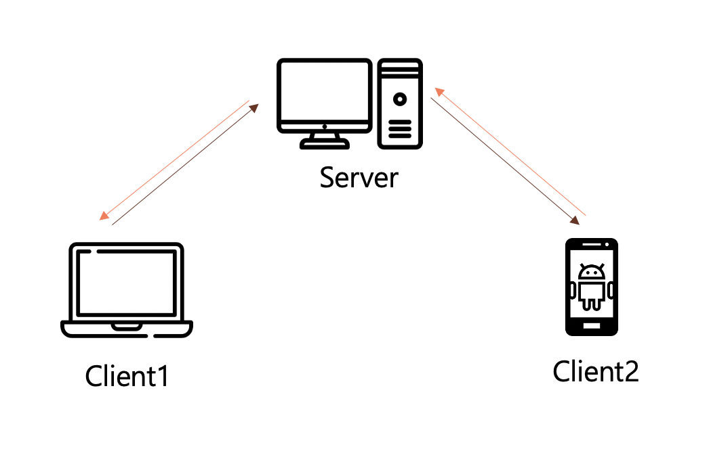
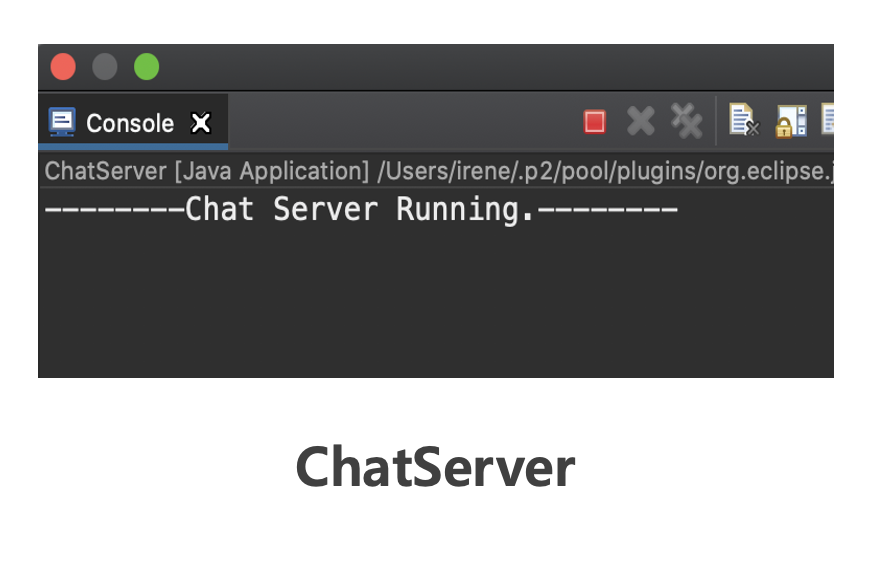
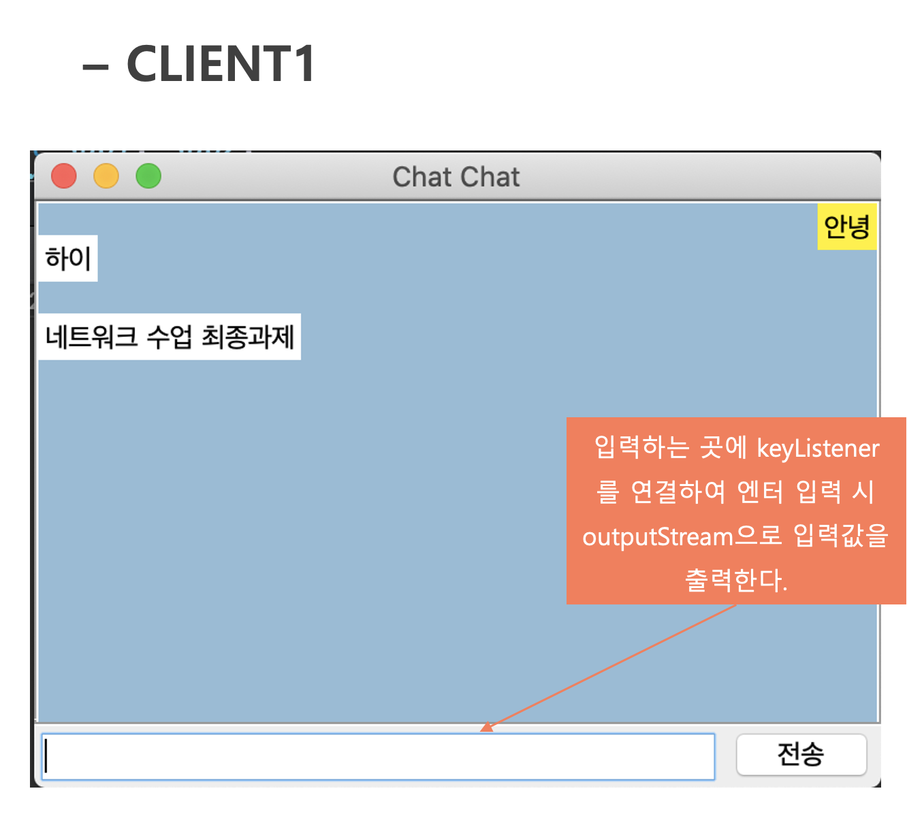
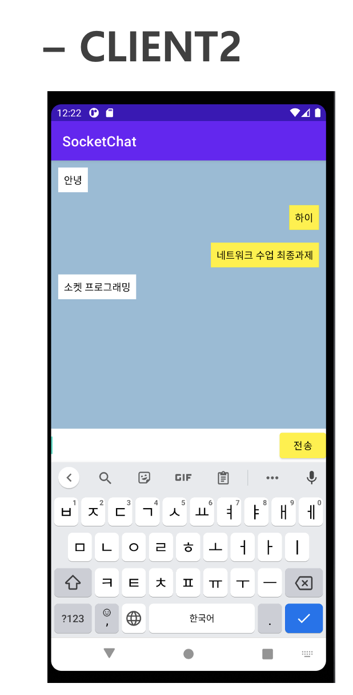

# Socket Programming 
> Socket program with one server and two clients.   
> Clients can receive or send messages to each other.
> This project was developed as a final assignment for 'Network' lecture.  
  
  
  ## :round_pushpin: Architecture    
  
  
  Client 1 :arrow_left: Server :arrow_right: Client 2    
  - Server (PC)
  - Client 1 (PC)
  - Client 2 (Android Mobile Device)  
  
  
  
  ## :round_pushpin: User Interface  
  
  - Server  
  
    
  
  Run Server before activating clients!  
  
  ---  
  
  - Client(1)    
   
  
  
  Press ```[Enter]``` or ```전송``` button to send message. 
  
  ---  
  
  - Client(2)  
  
  


  Receive real-time messages from Client1, and send real-time messages to Client2 by pressing ```전송``` button.  
  
  
  
  
  
